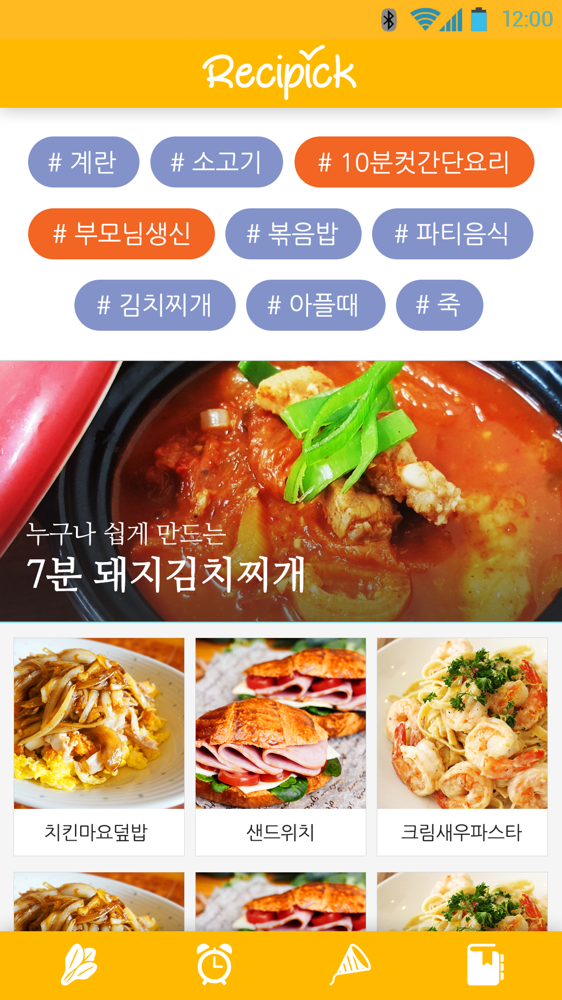

# ChefKim

팀명 : 김셰프
주제 : 태그로 분류하는 레시피 애플리케이션

인스타그램에서 #고양이 를 검색하면 고양이 사진이 나오는 것처럼, 레시피를 주재료/소요시간/먹는 상황/음식 종류에 따라 태그로 분류하여 "냉장고에 이런 재료가 있는데, 이걸로 뭘 만들지?" 또는 "이런 상황에서는 어떤 음식을 먹지?" 와 같은 질문에 대해 적절한 레시피를 찾을 수 있도록 해줌!

=======
인스타그램에서 #고양이 를 검색하면 고양이 사진이 나오는 것처럼, 레시피를 주재료/소요시간/먹는 상황/음식 종류에 따라 태그로 분류하여 "냉장고에 이런 재료가 있는데, 이걸로 뭘 만들지?" 또는 "이런 상황에서는 어떤 음식을 먹지?" 와 같은 질문에 대해 적절한 레시피를 찾을 수 있도록 해줌! 

**필요한 기술**  

1. 서버 구현   
2. 델리게이트 (서버 구현) 